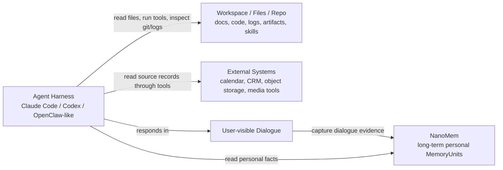
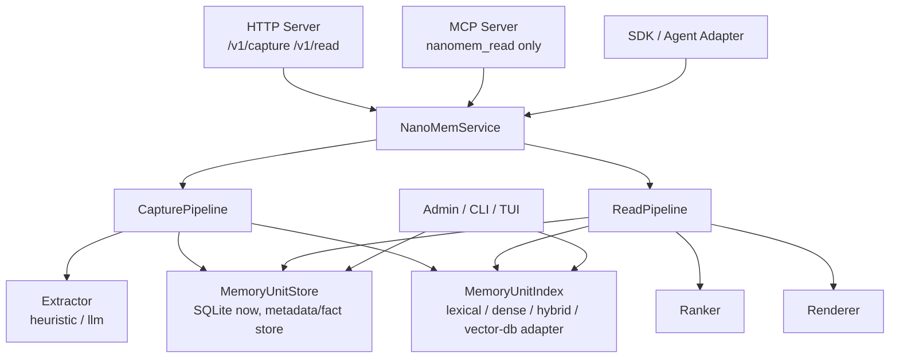
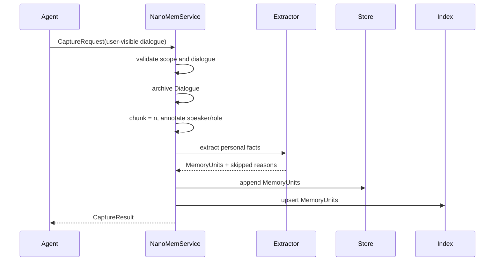
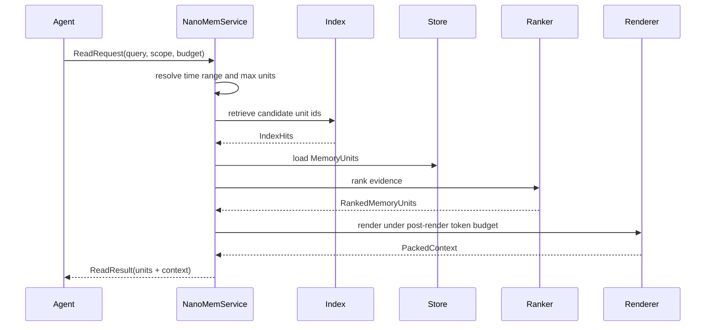
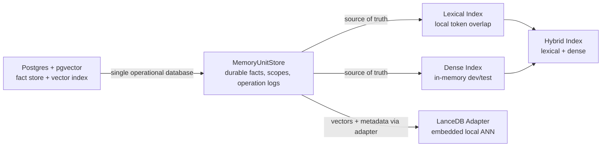

# NanoMem Architecture Overview

Status: draft

本文给出 NanoMem 的项目定位、运行时架构、核心流程和扩展边界。系统总设计见
`docs/system-design.md`。更细的产品边界见 `docs/nanomem-product-rfc.md`，agent 场景读写准则见
`docs/agent-memory-positioning.md`，代码级模块说明见
`docs/nanomem-code-architecture.md`。

## 1. Design Position

NanoMem 是 long-term personal memory database，不是 all-in-one memory
layer。它只管理长期个人记忆：偏好、纠正、习惯、个人背景、关系事实、用户
相关事件，以及会影响未来协作方式的 agent 交互事件。



核心原则：

- workspace artifacts 继续由文件系统、repo、日志系统或对象存储作为 source of truth；
- NanoMem 不复制项目文件、skills、raw tool output、多模态原文件或完整聊天归档；
- NanoMem 只存细粒度、可长期复用、用户相关的 `MemoryUnit`；
- `MemoryUnit` 通过 `DialogueRef` 指向用户可见对话证据，不直接引用文件、URI、bbox 或 raw tool result。

## 2. Runtime Components



The service layer owns orchestration. Stores, indexes, extractors, rankers, and
renderers are replaceable capabilities behind small interfaces.

## 3. Capture Flow



Capture is not event sourcing. It may store user-relevant event facts and
agent-interaction event facts, but only after they are extracted into durable
personal `MemoryUnit`s. Hidden reasoning, tool calls, tool results, ordinary
operation traces, and current task progress stay in the harness or logs.

## 4. Read Flow



Read returns evidence, not a canonical user profile. The renderer is part of
retrieval quality: under the same post-render token budget, it should preserve
as many relevant facts as possible while keeping timestamps and dialogue
evidence.

## 5. Store / Index Split

SQLite is the current supported durable fact store. It is a good default for
local, single-user, and agent-sidecar deployments. It should not be used as the
semantic vector retrieval database by storing vectors as JSON and scanning rows.

Local state should live under one NanoMem data directory by default:

```text
.nanomem/
  nanomem.db
  lancedb/
  backups/
  exports/
```



Current index backends:

| Backend | Purpose | Durability | Role |
| --- | --- | --- | --- |
| `dense` | bounded local embedding retrieval after scope filtering | in-memory derived index | default local baseline |
| `lexical` | deterministic token overlap | in-memory derived index | fallback / debugging baseline |
| `hybrid` | lexical + bounded dense merge | in-memory derived index | local experiments |
| LanceDB adapter | embedded ANN for local persistence | local vector-native store | future local extension |
| Postgres + pgvector | fact store plus ANN-capable vector index | server database | future managed extension |

The local dense index is intentionally bounded. It first narrows candidates by
owner/namespace scope, then scans recent candidates up to `index.dense_scan_limit`.
This avoids global full-index similarity scans while keeping the default
deployment dependency-free.

NanoMem should not implement ANN itself. If semantic retrieval needs to outgrow
the current in-memory dense index, delegate ANN to a database-backed
`MemoryUnitIndex` adapter:

- in-memory dense: simplest baseline for local smoke runs and tests;
- LanceDB: embedded local ANN when a sidecar needs persistent vector retrieval
  without running a server;
- Postgres + pgvector: managed fact store plus vector index when a deployment
  needs concurrency, metadata filtering, backups, retention, and audit in one
  database.

The service layer should not care which one is used.

## 6. Extension Points

```text
Extractor      -> improve fact extraction quality
EmbeddingModel -> swap local hashing for hosted or local embedding models
MemoryUnitStore -> keep SQLite now; add another store only when deployment requires it
MemoryUnitIndex -> keep in-memory simple; add LanceDB or pgvector adapters when needed
Ranker         -> combine relevance, recency, scope, and policy signals
Renderer       -> maximize useful fact coverage under token budget
Adapters       -> integrate agent harness lifecycle hooks
```

Keep extensions behind these interfaces. Do not let server code import concrete
store/index internals, and do not let adapters bypass `NanoMemService`.

## 7. Documentation Map

- `readme.md`: first-run guide and project summary.
- `docs/system-design.md`: top-level product and architecture design.
- `docs/nanomem-product-rfc.md`: product boundary and memory semantics.
- `docs/agent-memory-positioning.md`: how different agents should read/write memory.
- `docs/architecture-overview.md`: diagrams, runtime layout, and storage/index split.
- `docs/index-backends.md`: in-memory, LanceDB, and Postgres/pgvector index strategy.
- `docs/nanomem-code-architecture.md`: module-level implementation architecture.

## 8. Current Cleanup Decisions

- SQLite remains the local `MemoryUnitStore`.
- SQLite-backed JSON vector scanning is not a supported index backend.
- In-memory dense retrieval remains useful for tests and local experiments.
- NanoMem should not implement ANN. Future semantic retrieval should be added
  through LanceDB or Postgres/pgvector adapters, not by expanding SQLite
  responsibilities.
