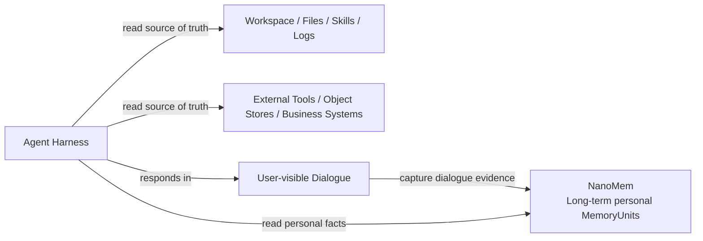
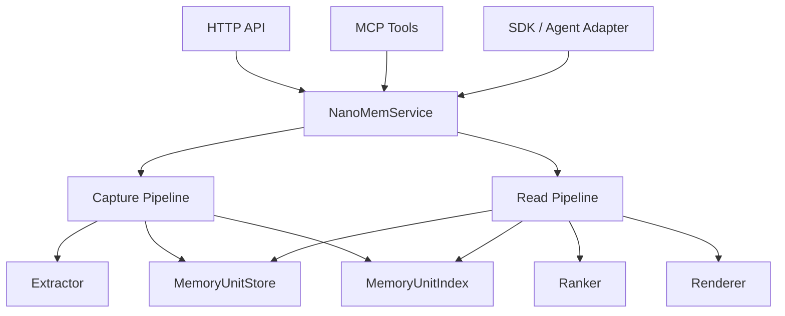

# NanoMem Overview

Status: draft

This document is the entry point for the modular NanoMem design spec. It
describes the intended system shape, not only the current implementation.

## 1. Positioning

NanoMem is a long-term personal memory database for agents.

It stores durable, user-related, third-person personal MemoryUnits. It does not
store workspace artifacts, project documents, skills, raw logs, raw multimodal
assets, or complete conversation archives.

Core claim:

```text
The agent reads the workspace. NanoMem helps it remember the user.
```

## 2. Why This Shape

Modern agent harnesses such as Claude Code, Codex, OpenClaw-like runtimes, and
Hermes-style skill systems already treat the local workspace as a first-class
context source. They can read files, search repositories, inspect git state,
run commands, use tools, and load local instruction or skill files.

NanoMem should not become a second workspace. Files, docs, skills, logs,
artifacts, and multimodal resources should remain in their native stores.
NanoMem stores only the durable personal facts that are hard for local file
storage to manage across sessions and projects.

This is narrower than all-in-one memory systems. The narrow scope is intentional:
it keeps retrieval focused on the user instead of mixing personal facts with
workspace content, documents, logs, and tool artifacts.

## 3. System Boundary



NanoMem owns:

- personal preferences;
- user corrections to agent behavior;
- cross-project habits;
- user background and relationship facts;
- user-relevant event facts;
- agent-interaction event facts that affect future collaboration;
- control-plane lifecycle for those facts, such as retention, export, backup,
  and privacy controls.

NanoMem does not own:

- project documents, README files, ADRs, code, or config;
- skills such as `SKILL.md`, scripts, templates, or assets;
- raw tool calls, stdout, logs, CI output, or task progress;
- raw PDF, image, audio, video, screenshots, or datasets;
- full chat archives or hidden reasoning.

## 4. Core Operations

NanoMem exposes two agent-facing operations:

```text
capture
read
```

`capture` receives user-visible dialogue and extracts durable personal
MemoryUnits.

`read` retrieves and renders relevant personal MemoryUnits as evidence for the
agent prompt.

Capture is dialogue-centered. External files, images, PDFs, browser pages, CRM
records, and tool results are consumed by the agent or tools; NanoMem captures
from user-visible dialogue, not those raw resources.

All admin operations, such as backup, export, retention, reindex, and integrity
checks, are control-plane operations. They should not be exposed as normal agent
memory tools.

## 5. Runtime Shape



The service layer owns orchestration. Stores, indexes, extractors, rankers, and
renderers are replaceable capabilities behind small interfaces.

This is a conceptual runtime shape, not an implementation order. The stable
boundary is `NanoMemService`; HTTP, MCP, SDK, and agent hooks are adapters.

## 6. Local Data Layout

Default local state should live under one data directory:

```text
.nanomem/
  nanomem.db
  lancedb/
  backups/
  exports/
```

SQLite is the default local fact store. LanceDB is the planned local persistent
ANN index when in-memory search is insufficient. Postgres + pgvector remains a
future managed-service path. Details live in `07-storage.md`,
`08-index-backends.md`, and `09-configuration.md`.

## 7. Spec Map

- `00-overview.md`: system overview and boundary.
- `01-product-boundary.md`: what NanoMem should and should not own.
- `02-memory-model.md`: conceptual objects and MemoryUnit style.
- `03-capture-api.md`: planned capture API and lifecycle.
- `04-read-api.md`: planned read API and result shape.
- `05-extraction.md`: extraction algorithm and quality rules.
- `06-retrieval-ranking-render.md`: retrieval, ranking, and renderer design.
- `07-storage.md`: fact store, migrations, retention, and local data.
- `08-index-backends.md`: in-memory, LanceDB, and pgvector index strategy.
- `09-configuration.md`: configuration schema and defaults.
- `10-interfaces-and-integration.md`: core interfaces and adapter integration.
- `11-behavior-cases.md`: expected behavior in concrete product scenarios.
- `12-operations-privacy.md`: admin, privacy, export, and delete.
- `13-roadmap.md`: staged implementation plan.
