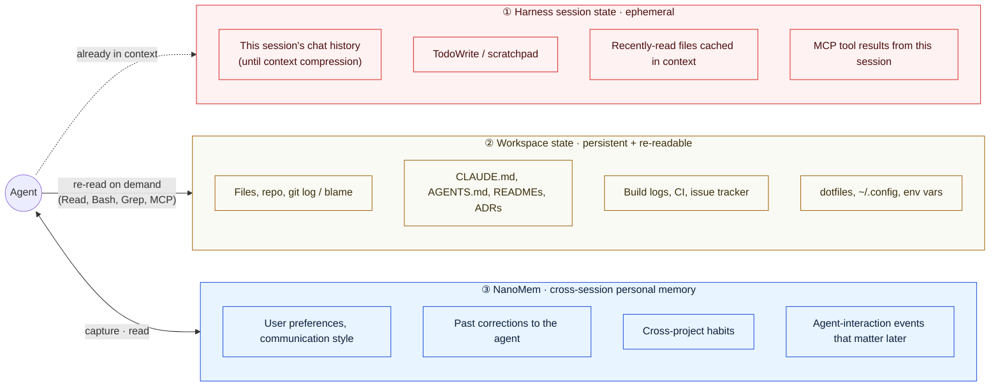
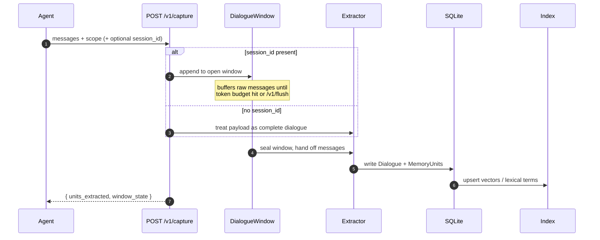
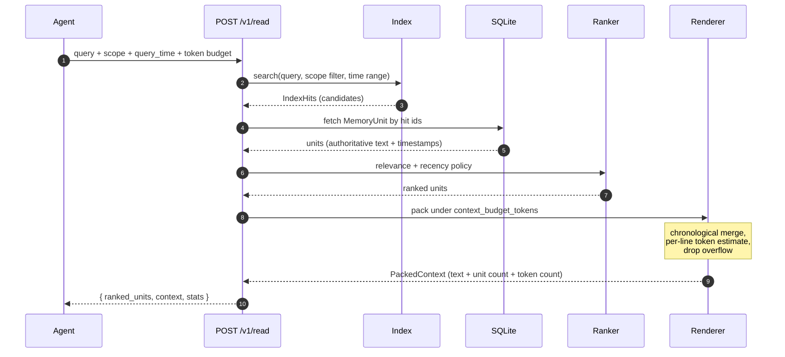
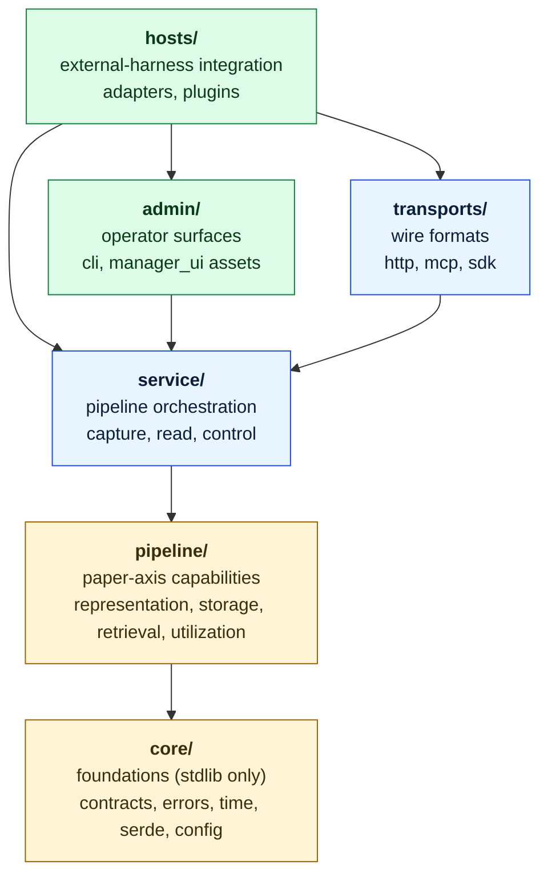

# NanoMem

[](https://github.com/Linzwcs/nanomem/actions/workflows/ci.yml)


**NanoMem is a local-first backend that stores one thing: long-term personal
memory for an AI agent.** Not a chat archive. Not a vector index over your
repo. Not a profile generator. Just durable, scope-tagged personal facts
the agent can recall on demand.

```text
The agent reads the workspace.
NanoMem helps it remember the user.
```

Status: alpha. The core local backend is implemented and tested. Public
contracts may still change before a stable release.

---

## Table Of Contents

- [The Boundary](#the-boundary) — three zones of agent context; where each fact lives
- [Core Design Principle](#core-design-principle) — evidence density under a budget
- [How It Works](#how-it-works) — object lifecycle, capture + read flows
- [What To Store / Not To Store](#what-to-store--not-to-store) — the rule of thumb
- [Quick Start](#quick-start)
- [Interfaces](#interfaces) — HTTP, SDK, MCP, CLI
- [Architecture](#architecture) — six horizontal layers
- [Configuration](#configuration)
- [Agent Integrations](#agent-integrations)
- [Development](#development)
- [Security And Data](#security-and-data)
- [Documentation Map](#documentation-map)

---

## The Boundary

The single most important fact about NanoMem is what it refuses to be.
Coding agents like Claude Code, Codex, and OpenClaw-style runtimes
already have powerful, fast, exact access to two distinct kinds of
state. NanoMem owns only a third kind that the other two **structurally
cannot hold**.

### Three Zones Of Agent Context



**Zone ① — Harness session state.** Whatever the agent and user just
said and did. The harness owns this trivially: it's already in the
LLM's input window. Dies on restart or context compression. NanoMem
does **not** try to replace this — the harness is better at it than any
external store could ever be.

**Zone ② — Workspace state.** Anything that can be re-read by running
a tool. Files, git history, `CLAUDE.md` conventions, CI logs, dotfiles,
MCP-reachable databases. The harness re-reads on demand; the data is
authoritative wherever it natively lives. NanoMem does **not** try to
mirror this — duplicating it produces stale, lossy, scope-mixed copies
of facts the agent could just reread.

**Zone ③ — Cross-session personal memory.** Facts about the user that
the agent needs in a *future* session, in a *different* project, on a
*different* machine. Neither zone ① nor zone ② can carry these:

| Where ad-hoc alternatives fail | Why |
| --- | --- |
| `CLAUDE.md` / `AGENTS.md` | shared per-project, no per-user scope, always-on (eats context whether relevant or not) |
| `~/.config/agent.md` dotfile | flat text, no time, no retrieval, no evidence chain, no budget control |
| Chat archive in a vector DB | recreates the boundary problem — now you have raw dialogue in retrieval, diluting the budget |
| Re-asking the user every session | breaks the point of having an agent |

NanoMem is the third zone. Everything in its design — scope-tagged
units, timestamps, dialogue refs, budget-aware rendering — is what zone
① and zone ② structurally lack.

### What "Personal Memory" Actually Means

A `MemoryUnit` carries:

```text
owner_id + namespace       who this fact is about and in what context
text                       third-person, evidence-grounded statement
timestamp                  when the fact became true
available_at               when it became eligible for retrieval
dialogue_refs              the originating dialogue + message range
metadata                   extractor name, source role, etc.
```

This shape exists because the future agent needs to **reason** over the
fact — across time, across conflicting evidence, across scope. A raw
chat archive can't do that. A flat preferences file can't do that.

### Concrete Allocation

| Concern | Where it lives | NanoMem? |
| --- | --- | --- |
| What we discussed this turn | Harness session | No |
| Current source code / configs | Workspace (files) | No |
| Build / test / CI status | Workspace (logs, CI) | No |
| Project conventions, style | Workspace (`CLAUDE.md`, etc.) | No |
| Live MCP query results | Harness session | No |
| "User prefers concise Chinese answers" | — | **Yes** |
| "User corrected the agent not to auto-commit code" | — | **Yes** |
| "User joined the design review meeting on May 22" | — | **Yes** |
| "User is allergic to nuts" (background fact) | — | **Yes** |

### Good Fits

- coding / local agents (Codex, Claude Code, OpenClaw-style runtimes);
- personal assistants needing durable preferences and corrections;
- MCP hosts that want a small read-only memory sidecar;
- local-first deployments where SQLite is enough as source of truth.

### Explicit Non-Goals

- workspace search replacement;
- RAG over project files or documentation;
- task / issue / run-log database;
- raw event sourcing or chat archive product;
- canonical user-profile maintenance (synthesized "the user is X" judgements);
- a memory layer that lives inside the harness session window.

If you are looking for any of the non-goals above, NanoMem is the
wrong tool — and on purpose.

---

## Core Design Principle

Personal memory only helps an agent through the **bounded block of text
that reaches the LLM at answer time**. Recall in isolation is the wrong
metric; the right one is the **density of useful evidence inside that
final rendered block**.

The Boundary above is a direct corollary: if you blur the line and
ingest workspace state or session chat into the personal-memory store,
you dilute the bounded budget with facts the agent could have re-read
for free. The principle and the boundary are the same idea — one in
information-theoretic language, one in product-shape language.

This claim was studied in the companion paper *Long-Term Personal
Memory Under Budget: An Evidence-Density Principle* (experiment code
in [nanomem-exp](../nanomem-exp), branch `initial-experiment-code`).
Two design axes were varied under a fixed post-render token budget on
LoCoMo and LongMemEval:

- **Representation** — how dialogue becomes memory: interaction pairs,
  chunks, summaries, or **atomic fact records**;
- **Utilization** — how retrieved units are ordered, merged, and packed
  into the prompt: `default`, `merge`, `time`, `time+merge`.

The controlled finding: **fact-style records + chronological merging
(`Fact + Time+Merge`)** are the strongest combination across budgets.
NanoMem's production stack is exactly that configuration —
`pipeline/representation/` produces atomic facts, `pipeline/utilization/`
packs ranked facts with timestamps under a token budget.

### Validation Snapshot

Protocol-aligned numbers from the paper draft. External rows use
different reporting protocols and are shown as references.

LoCoMo system comparison (Overall, ↑ better):

| Method        | Tokens | Overall   |
| ------------- | -----: | --------: |
| Mem0          |   1.0k |     64.20 |
| MemOS         |   2.5k |     80.76 |
| Zep           |   1.4k |     85.22 |
| EverMemOS     |   2.3k | **93.05** |
| **Ours (1.0k)** | 1.75k | **92.92** |

LongMemEval system comparison (Overall, ↑ better):

| Method          | Tokens | Overall   |
| --------------- | -----: | --------: |
| Mem0            |   1.1k |     66.40 |
| MemOS           |   1.4k |     77.80 |
| EverMemOS       |   2.8k |     83.00 |
| **Ours (1.0k)** | 1.75k |     87.40 |
| **Ours (2.0k)** | 2.75k | **89.20** |

Controlled 1000-token budget (mean of three runs):

| Dataset     | Best controlled setting | Overall   |
| ----------- | ----------------------- | --------: |
| LoCoMo      | Fact + Time+Merge       | **75.11** |
| LongMemEval | Fact + Time+Merge       | **84.07** |

Reproduction configs live in `nanomem-exp` on the
`initial-experiment-code` branch. This repository is the production
backend those experiments validate.

---

## How It Works

### Object Model

NanoMem keeps raw capture, window control, durable memory, and retrieval
in separate layers. Scope (`owner_id + namespace`) lives on the
**MemoryUnit**, not the dialogue — capture is scope-free; extraction is
where personal memory is born.

```mermaid
flowchart LR
    s["<b>Session</b><br/>capture stream"]
    d["<b>Dialogue</b><br/>archived messages"]
    w["<b>DialogueWindow</b><br/>open buffer +<br/>extraction lifecycle"]
    u["<b>MemoryUnit</b><br/>durable personal fact<br/>(owner + namespace)"]
    h["<b>IndexHit</b><br/>derived retrieval<br/>candidate"]
    p["<b>PackedContext</b><br/>rendered evidence<br/>for the prompt"]

    s --> d
    d --> w
    w -- "seal + extract" --> u
    u -- "upsert" --> idx[(Index)]
    idx -- "search" --> h
    u -- "fetch" --> h
    h -- "rank + render<br/>under budget" --> p

    classDef store fill:#fff4d6,stroke:#a16207,color:#3a2e0b
    classDef derived fill:#e8f4ff,stroke:#1d4ed8,color:#0b1f3a
    classDef render fill:#dcfce7,stroke:#15803d,color:#0b3a18
    class s,d,w,u store
    class idx,h derived
    class p render
```



Three rules that fall out of this shape:

- **MemoryUnit is the only object that carries scope.** Dialogue is
  audit evidence with no `owner_id`.
- **Indexes are derived data.** Any index can be wiped and rebuilt from
  the SQLite store. Never expand SQLite into a vector engine.
- **Rendered context is the product.** Retrieval that doesn't fit the
  budget didn't help.

### Capture Flow



`/v1/flush` is window control, not a write. It seals pending buffers so
extracted units become searchable — required when a session pauses or
exits before the token window fills naturally.

### Read Flow



The response separates **ranked** (everything retrieval found, in order)
from **rendered** (what fit the budget). Agents that need to reason over
"what else was nearly retrieved" can inspect the ranked list. The agent
prompt should use `context.text` directly.

### Preferred Memory Style

Third-person, evidence-grounded, timestamped:

```text
The user said they prefer concise Chinese answers.
The user corrected the agent not to auto-commit code.
The agent auto-committed code and the user reacted negatively.
```

Avoid first-person commands and project-style assertions:

```text
Do not auto-commit code.            ← hidden instruction, not evidence
Always answer in Chinese.           ← same problem
This repo uses pytest.              ← workspace fact, belongs in CLAUDE.md/README
```

The downstream agent reasons over evidence, time, scope, and conflicts.
NanoMem must not silently synthesize a canonical user profile.

---

## What To Store / Not To Store

Store durable, user-related personal facts:

- user preferences and communication style;
- user corrections to agent behavior;
- stable cross-project engineering habits;
- personal background and relationship facts;
- user-relevant events that matter later;
- agent-interaction events that change future collaboration;
- personal facts extracted from discussions of multimodal resources.

Do not store:

- READMEs, ADRs, code, configuration, or project docs;
- raw PDFs, images, audio, video, screenshots, or datasets;
- CI logs, build output, raw tool output, or hidden reasoning;
- current task plans, scratchpads, issue state, or run logs;
- complete chat archives;
- facts the agent can reliably read again from workspace or source systems.

### Rule Of Thumb

```text
If the agent can read it again from the workspace, repo, logs, object storage,
or a business system — do not put it in NanoMem.

If it is a cross-session personal fact that changes how the agent should
understand or collaborate with the user — put it in NanoMem.
```

---

## Quick Start

Install locally from the repository root:

```bash
python -m pip install -e ".[dev]"
nanomem --help
nanomem-server --help
nanomem-mcp --help
```

Create `nanomem.json`:

```json
{
  "data_dir": ".nanomem",
  "store": { "backend": "sqlite" },
  "index": { "backend": "dense" },
  "extraction": { "backend": "heuristic" },
  "read": {
    "default_recency_policy": "balanced",
    "default_max_units": 10
  }
}
```

Start the local HTTP sidecar and check health:

```bash
nanomem-server --config nanomem.json --host 127.0.0.1 --port 8765
curl http://127.0.0.1:8765/v1/health
```

Capture one user-visible turn:

```bash
curl -X POST http://127.0.0.1:8765/v1/capture \
  -H 'Content-Type: application/json' \
  -d '{
    "scope": {"owner_id": "demo-user", "namespace": "personal"},
    "dialogue": {
      "messages": [
        {
          "role": "user",
          "speaker_id": "user:demo-user",
          "content": "I prefer concise Chinese answers. Please remember that I usually want architecture first, then code.",
          "timestamp": "2026-05-19T10:00:00+08:00"
        }
      ],
      "occurred_at": "2026-05-19T10:00:00+08:00",
      "metadata": {"host": "quickstart"}
    },
    "capture_time": "2026-05-19T10:00:05+08:00"
  }'
```

Read relevant memory under a token budget:

```bash
curl -X POST http://127.0.0.1:8765/v1/read \
  -H 'Content-Type: application/json' \
  -d '{
    "owner_id": "demo-user",
    "namespaces": ["personal"],
    "query": "answer style architecture first",
    "query_time": "2026-05-19T10:10:00+08:00",
    "max_units": 3,
    "context_budget_tokens": 512
  }'
```

The response contains ranked units and a packed, timestamped context block:

```json
{
  "context": {
    "text": "Relevant memory units:\n- [2026-05-19T10:00:00+08:00, namespace=personal] Please remember that I usually want architecture first, then code.",
    "token_count": 42,
    "unit_count": 1
  }
}
```

Open the local manager while the server is running:

```text
http://127.0.0.1:8765/manager
```

The manager is a React + Vite control-plane UI for inspecting sessions,
dialogue windows, memory units, operation logs, retrieval previews, and
index health. **Never** expose `/manager` or `/manager/api/*` as
agent-facing tools or to untrusted networks.

Full request/response examples:
[docs/reports/request-response-examples.md](docs/reports/request-response-examples.md).

---

## Feature Status

| Area              | Status        | Notes |
| ----------------- | ------------- | ----- |
| Core contracts    | In transition | `Session`, `Dialogue`, `DialogueWindow`, `MemoryUnit` |
| Local store       | Implemented   | SQLite fact store with migrations and operation logs |
| Capture pipeline  | Implemented   | Heuristic extractor by default; LLM extractor optional |
| Read pipeline     | Implemented   | retrieval, ranking, evidence rendering, token budget |
| HTTP API          | Implemented   | `/v1/health`, `/v1/capture`, `/v1/flush`, `/v1/read` |
| Python SDK        | Implemented   | sync and async HTTP clients |
| MCP server        | Implemented   | stdio server exposing read-only `nanomem_read` |
| CLI               | Implemented   | stats, list, logs, migrations, integrity, backup, export, reindex, flush, retention, Codex hook install |
| Web manager       | Local alpha   | React 19 + Vite 8, bundled into `nanomem.admin.manager_ui` |
| Index backends    | Local alpha   | lexical, dense, hybrid, optional LanceDB |
| Agent plugins     | Experimental  | Codex project hooks plus Codex and Claude Code plugin skeletons |
| Managed deployment| Planned       | Postgres + pgvector is a future path, not the current default |

---

## Interfaces

The agent-facing surface is intentionally small: **capture** and **read**.
Everything else (admin, backup, export, retention, reindex, raw dialogue
inspection) belongs to CLI or control-plane surfaces — never to model-
selected tools.

### HTTP

```text
GET  /v1/health
POST /v1/capture
POST /v1/flush
POST /v1/read
```

Capture without `session_id` treats the payload as a complete dialogue
and extracts immediately. Capture with `session_id` appends raw messages
to that session's open dialogue window; call `/v1/flush` when a session
pauses, exits, or should become searchable before the token window fills.

### Python SDK

```python
from nanomem import (
    CaptureDialogue,
    CaptureRequest,
    DialogueMessage,
    MemoryScope,
    NanoMemClient,
    ReadRequest,
)

client = NanoMemClient("http://127.0.0.1:8765")

client.capture(
    CaptureRequest(
        scope=MemoryScope(owner_id="demo-user", namespace="personal"),
        dialogue=CaptureDialogue(
            occurred_at="2026-05-19T10:00:00+08:00",
            messages=(
                DialogueMessage(
                    role="user",
                    content="I prefer concise Chinese answers.",
                    timestamp="2026-05-19T10:00:00+08:00",
                ),
            ),
        ),
        capture_time="2026-05-19T10:00:05+08:00",
    )
)

result = client.read(
    ReadRequest(
        owner_id="demo-user",
        namespaces=("personal",),
        query="answer language preference",
        query_time="2026-05-19T10:01:00+08:00",
        max_units=5,
    )
)

print(result.context.text)
```

`AsyncNanoMemClient` mirrors the same surface for async hosts.

### MCP

Run the stdio MCP server:

```bash
nanomem-mcp --config nanomem.json
```

MCP exposes `nanomem_read` only. Writes go through hook capture, the
SDK, or the HTTP API — never through model-selected MCP tools.
Control-plane actions (backup, export, retention, reindex) also stay
out of the MCP surface.

### CLI

The CLI manages the local SQLite database and maintenance workflows:

```bash
nanomem stats --config nanomem.json
nanomem list --config nanomem.json --limit 20
nanomem logs --config nanomem.json
nanomem migrations --config nanomem.json
nanomem integrity-check --config nanomem.json
nanomem reindex --config nanomem.json

nanomem backup  --config nanomem.json --output .nanomem/backups/backup.db
nanomem export  --config nanomem.json --output .nanomem/exports/export.json
nanomem retention-preview      --config nanomem.json --before 2026-01-01T00:00:00+00:00
nanomem log-retention-preview  --config nanomem.json --before 2026-01-01T00:00:00+00:00
```

Without the package installed, use module entry points from the repo
root:

```bash
PYTHONPATH=src python -m nanomem.admin.cli       --help
PYTHONPATH=src python -m nanomem.transports.http --help
PYTHONPATH=src python -m nanomem.transports.mcp  --help
```

---

## Architecture

`src/nanomem/` is organized as **six horizontal layers**, each importing
only from layers below it. The structure mirrors the experimental axes in
the companion paper. `tools/check_layering.py` and
`tests/test_layering.py` enforce the rule.



Layering rule (machine-enforced):

```text
hosts/      may import service, transports, admin, pipeline, core
admin/      may import service, pipeline, core
transports/ may import service, pipeline, core
service/    may import pipeline, core
pipeline/   may import core
core/       only stdlib
```

The service layer owns orchestration. Stores, indexes, extractors,
rankers, and renderers are replaceable capabilities behind small
interfaces — they do not decide capture/read behavior. Transport code
must not import concrete store/index internals; host adapters must not
bypass `NanoMemService`.

### Directory Tree

```text
src/nanomem/
  core/                  foundations (stdlib only)
    contracts/           frozen dataclasses for the public surface
    errors.py            NanoMemError hierarchy
    ids.py, time.py      ID + timestamp helpers
    serde.py             dict ↔ contract conversion
    config.py            config schema + loaders

  pipeline/              paper-axis-aligned capabilities
    representation/      heuristic + LLM extraction → atomic fact units
    storage/             SQLite fact store
    retrieval/
      indexes/           lexical, dense, hybrid, LanceDB
      embeddings/        hashing (default), openai_compatible
      ranking/           relevance + recency (relevance_recency.py)
    utilization/         budget-aware evidence rendering
                         (evidence_context.py)

  service/               pipeline orchestration
    core.py / async_core.py
    capture.py / read.py
    facade.py            ControlFacade for the manager UI
    factory.py           config-driven construction
    control/             control-plane operations

  transports/            wire formats for agent harnesses
    http/                stdlib server (v1 data plane + manager UI)
    mcp/                 stdio MCP server (read-only)
    sdk/                 sync + async HTTP clients

  admin/                 operator-facing tools
    cli/                 `nanomem` command-line
    manager_ui/          bundled HTML/CSS/JS for the manager UI

  hosts/                 external-harness integration
    adapters/            AgentMemoryAdapter + MCP adapter
    plugins/             hook runner, Codex install helper

manager-ui/              React/Vite manager source (builds into
                         src/nanomem/admin/manager_ui/)
tools/                   maintenance scripts (check_layering.py)
docs/                    product, architecture, manager, plugin docs
tests/                   pytest regression tests
```

---

## Configuration

Default local state lives under one data directory:

```text
.nanomem/
  nanomem.db
  lancedb/
  backups/
  exports/
```

Supported config values:

| Key                         | Values                                       |
| --------------------------- | -------------------------------------------- |
| `store.backend`             | `sqlite`                                     |
| `index.backend`             | `lexical`, `dense`, `hybrid`, `lancedb`      |
| `index.embedding.backend`   | `hashing`, `openai_compatible`               |
| `extraction.backend`        | `heuristic`, `llm`                           |
| `read.default_recency_policy` | `recent`, `balanced`, `historical`         |

The default local setup is dependency-light:

- SQLite is the fact store;
- `dense` is the default index backend with bounded scope-filtered scan;
- deterministic local hashing is the default embedding model;
- `heuristic` is the default extractor;
- `index.rebuild_on_startup = true` rebuilds derived indexes from SQLite.

Use environment variables for provider credentials. Do not put API keys
in config files committed to the repository.

### Optional LanceDB

For larger-scale local ANN, install the optional dependency:

```bash
python -m pip install -e ".[dev,lancedb]"
```

Configure the local vector index:

```json
{
  "index": {
    "backend": "lancedb",
    "path": ".nanomem/lancedb",
    "table": "memory_units",
    "distance_type": "cosine"
  }
}
```

LanceDB stores retrieval fields and embeddings. SQLite remains the
source of truth for `MemoryUnit` and `Dialogue`.

NanoMem itself does not implement ANN. The in-memory `dense` index is
deliberately bounded (scope-filter first, then scan up to
`index.dense_scan_limit`). For real ANN, use LanceDB or a future
Postgres + pgvector adapter — never expand SQLite into a vector engine
via JSON scans.

---

## Agent Integrations

NanoMem follows a simple lifecycle:

```text
before_turn:
  agent reads workspace/tools
  agent calls NanoMem.read for personal evidence

after_turn:
  agent sends user-visible dialogue to NanoMem.capture
```

Repo-local plugin skeletons:

```text
.agents/plugins/marketplace.json
plugins/nanomem-codex/
plugins/nanomem-claude-code/
```

Hook runner examples:

```bash
nanomem-agent-hook spool   --host codex
nanomem-agent-hook read    --host codex
nanomem-agent-hook capture --host codex
nanomem-agent-hook spool   --host claude-code
nanomem-agent-hook read    --host claude-code
nanomem-agent-hook capture --host claude-code
```

For Codex, install project-level hooks:

```bash
nanomem install-codex-hooks --project-dir .

export NANOMEM_BASE_URL=http://127.0.0.1:8765
export NANOMEM_OWNER_ID="$USER"
export NANOMEM_NAMESPACE=personal
```

Plugin-bundled Codex hooks remain an opt-in packaging path and should be
validated separately. Plugin docs:

- [docs/plugins/README.md](docs/plugins/README.md)
- [docs/plugins/codex.md](docs/plugins/codex.md)
- [docs/plugins/codex-installation.md](docs/plugins/codex-installation.md)
- [docs/plugins/claude-code.md](docs/plugins/claude-code.md)

---

## Development

Install dev dependencies and run the test suite:

```bash
python -m pip install -e ".[dev]"
python -m pytest
```

Run a focused LanceDB integration test after installing the extra:

```bash
python -m pip install -e ".[dev,lancedb]"
python -m pytest tests/index/test_lancedb_integration.py
```

CI runs `compileall` and `pytest` on Python 3.10, 3.11, and 3.12.

For benchmark reproduction (LoCoMo, LongMemEval, paired comparisons,
budget curves), use the experiment platform in
[`nanomem-exp`](../nanomem-exp), branch `initial-experiment-code`. That
repository is the artifact-first evaluation harness; this repository is
the production backend.

---

## Security And Data

NanoMem stores personal memory data.

- Do not commit `.nanomem/`, local databases, exports, backups, `.env`,
  or API keys.
- Bind the HTTP server to `127.0.0.1` for local use.
- Do not expose `/manager` or `/manager/api/*` to untrusted networks.
- Keep raw workspace files, logs, tool output, and multimodal assets
  outside NanoMem.
- Use backup/export/retention commands with temporary paths in tests.
- Enable hook debug payloads only temporarily; they may contain prompt
  or transcript metadata.

---

## Documentation Map

Design and product context:

- [docs/system-design.md](docs/system-design.md) — top-level product and architecture design.
- [docs/nanomem-product-rfc.md](docs/nanomem-product-rfc.md) — product boundary and memory semantics.
- [docs/agent-memory-positioning.md](docs/agent-memory-positioning.md) — agent read/write guidance.
- [docs/architecture-overview.md](docs/architecture-overview.md) — diagrams, runtime layout, store/index split.
- [docs/index-backends.md](docs/index-backends.md) — in-memory, LanceDB, and Postgres/pgvector strategy.
- [docs/nanomem-code-architecture.md](docs/nanomem-code-architecture.md) — module-level implementation architecture.
- [docs/manager/README.md](docs/manager/README.md) — web manager and control-plane design.
- [docs/reports/request-response-examples.md](docs/reports/request-response-examples.md) — complete API examples.

Companion evaluation work:

- [`nanomem-exp`](../nanomem-exp), branch `initial-experiment-code` —
  experiment configs, runners, and result tables for *Long-Term
  Personal Memory Under Budget: An Evidence-Density Principle*.

---

## License

MIT. See package metadata in [pyproject.toml](pyproject.toml).
